# JobData Platform

[](https://github.com/Hillgrove/JobDataPlatform/actions/workflows/ELT-pipeline.yml)
[](https://dotnet.microsoft.com/)
[](https://learn.microsoft.com/en-us/dotnet/csharp/)
[](https://cloud.google.com/)
[](https://cloud.google.com/bigquery)

> En fuldt automatiseret ELT-pipeline der dagligt indsamler danske jobopslag fra Jobindex og Google Jobs, loader dem i Google Cloud og transformerer dem til et analyseklart datavarehus i BigQuery.

---

## Indhold

- [Om projektet](#om-projektet)
- [Arkitektur](#arkitektur)
- [Tech stack](#tech-stack)
- [Datamodel](#datamodel)
- [Kom i gang](#kom-i-gang)
- [CI/CD](#cicd)

---

## Om projektet

JobData Platform indsamler løbende jobopslag fra det danske arbejdsmarked og bearbejder dem til strukturerede, analyseklare data. Systemet henter data fra to kilder:

- **Jobindex.dk** — via RSS-feed med efterfølgende HTML-scraping af stillingsbeskrivelser
- **Google Jobs** — via SerpApi, der aggregerer jobopslag på tværs af platforme

Rådataene berige med rolletyper, senioritetsniveauer, teknologier og kompetencer gennem mønsterbaseret matching. Resultatet er et flerlags BigQuery-datavarehus, der muliggør analyse af det danske IT-jobmarked.

---

## Arkitektur

Systemet er bygget op som en klassisk **ELT-pipeline** (Extract → Load → Transform) fordelt over fire C#-moduler:



BigQuery-tabellernes indbyrdes afhængigheder:



**Moduloversigt:**

| Modul | Ansvar |
|---|---|
| `CLI` | Orkestrerer hele pipelinen — kalder Extract → Upload → Load → Transform |
| `Extract` | Scraper Jobindex og kalder SerpApi; outputter NDJSON-filer |
| `DataTransfer` | Uploader filer til GCS; loader GCS-data ind i BigQuery råtabeller |
| `Transform` | Eksekverer SQL-transformationer i BigQuery (dagligt og fuld genopbygning) |

---

## Tech stack

| Kategori | Teknologi | Anvendelse |
|---|---|---|
| **Sprog** | C# / .NET 8 | Al applikationskode |
| **Datavarehus** | Google BigQuery | Opbevaring og transformation af data |
| **Cloud storage** | Google Cloud Storage | Staging af rå NDJSON-filer |
| **API** | SerpApi | Adgang til Google Jobs-opslag |
| **HTML-parsing** | HtmlAgilityPack | Scraping af stillingsbeskrivelser fra Jobindex |
| **RSS-parsing** | System.ServiceModel.Syndication | Læsning af Jobindex RSS-feed |
| **Serialisering** | Newtonsoft.Json | NDJSON-output og API-respons-parsing |
| **CI/CD** | GitHub Actions | Automatiseret kørsel af pipelinen |

---

## Datamodel

BigQuery-datasættet er opbygget i lag, der svarer til et klassisk dimensionelt datawarehouse:

```
Lag 0 — Rå data
  raw_jobindex              Ubehandlede jobopslag fra Jobindex (partitioneret pr. dag)
  raw_serpapi               Ubehandlede jobopslag fra Google Jobs (partitioneret pr. dag)

Lag 1 — Referencetabeller
  ref_roles                 Jobrolle-kategorier (fx Backend Developer, Data Engineer)
  ref_levels                Senioritetsniveauer (fx Junior, Senior, Lead)
  ref_skills                Kompetencer og teknologier
  ref_programming_languages Programmeringssprog
  ref_databases_and_storage Databaseteknologier
  ref_web_frameworks_and_technologies  Frameworks og webteknologier

Lag 2 — Enriched
  enriched_job_listings     Normaliserede og deduplikerede jobopslag fra begge kilder,
                            beriget med roller, niveauer og kompetencer via MERGE

Lag 3 — Dimensioner
  dim_companies             Virksomhedsdimension
  dim_domains               Fagdomæne-dimension
  dim_technologies          Teknologidimension
  dim_stop_words            Stopord til tekstbehandling

Lag 4 — Relationer (N:M)
  rel_job_details_domains   Kobling mellem jobopslag og fagdomæner
  rel_job_technologies      Kobling mellem jobopslag og teknologier

Lag 5 — Fakta og rapportering
  fct_jobs                  Faktabel til analytiske forespørgsler
  rep_jobs_exploded         Rapporteringsview med eksploderede arrays
  rep_jobs_flattened        Rapporteringsview med fladede strukturer
```

Transformationerne kører i to modi:
- **Daily** (`Transform/sql/daily/`) — inkrementel opdatering via `MERGE` på nye data
- **Non-daily** (`Transform/sql/non-daily/`) — fuld genopbygning af alle tabeller

---

## Kom i gang

### Forudsætninger

- [.NET 8 SDK](https://dotnet.microsoft.com/download/dotnet/8.0)
- En Google Cloud-konto med BigQuery og Cloud Storage aktiveret
- En GCP Service Account med nøgle (JSON)
- En [SerpApi](https://serpapi.com/)-nøgle

### Opsætning

**1. Klon repositoriet**

```bash
git clone https://github.com/Hillgrove/JobDataPlatform.git
cd JobDataPlatform
```

**2. Placer GCP-nøglen**

```bash
# Opret mappen og placer din service account-nøgle her:
DataTransfer/Secrets/gcs-key.json
```

> Filen er listet i `.gitignore` og bliver aldrig committed.

**3. Sæt miljøvariabel**

```bash
export SERP_API_KEY="din-serp-api-nøgle"
```

**4. Kør pipelinen**

```bash
dotnet restore CLI/CLI.csproj
dotnet run --project CLI/CLI.csproj
```

Pipelinen kører hele flowet: Extract → Upload → Load → Transform.

---

## CI/CD

Pipelinen eksekveres automatisk via **GitHub Actions** (`.github/workflows/ELT-pipeline.yml`).

Workflowet kan trigges manuelt via `workflow_dispatch` i GitHub-brugerfladen og konfigureres til at køre nightly via cron.

**Secrets der skal konfigureres i GitHub:**

| Secret | Beskrivelse |
|---|---|
| `GCP_SA_KEY` | Base64-encoded GCP service account JSON |
| `SERP_API_KEY` | API-nøgle til SerpApi |

Workflowet decoder automatisk `GCP_SA_KEY` og gemmer nøglen til `DataTransfer/Secrets/gcs-key.json` inden pipelinen startes.
